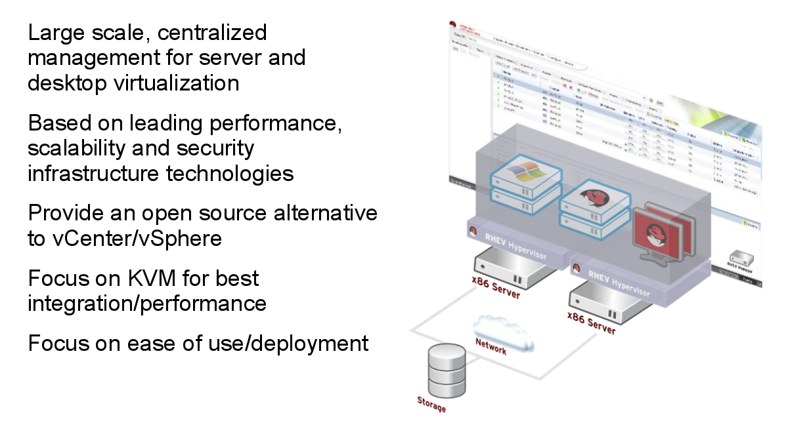

# About Ovirt

 
  oVirt is a community project from **Red Hat** .oVirt is a **virtual datacenter manager** that delivers powerful management of multiple virtual machines on multiple hosts.It is also the innovation engine for **RHEV**(Red Hat Enterprise Virtualization). Any new features that appear in RHEV appear in oVirt first.

oVirt Features include:

* Manage multiple virtual machines via web browser
* Sophisticated user interface allows management of all aspects of your datacenter
* Choice of means of allocation of VMs to hosts: manual, "optimized", pinned
* Live migration of VMs from one hypervisor to another
* Add new hypervisor nodes easily and centrally
* Monitor resource usage on VMs
* Manage quotas for use of resources (storage, compute, network)
* Self-service console for simple and advanced use cases
* Standalone or add-on installation
* High availability
* Self-hosted engine
* iSCSI, Fibre Channel, NFS, and local storage
* Load balancing
* Built on KVM hypervisor
* Open source

## Work I have done
I worked on adding feature for Backup Storage Domain.

### Backup Storage Domain

This feature will add another functionality layer to the oVirt Disaster Recovery solution. It will allow any data storage domain to use as a backup domain and hence will remove the limitations of export storage domain. Adding functionality of backup storage domain deprecate the use of export storage domain and in future may replace it.

## Work Summary
Until now, one of the solutions to backup VMs and Templates in oVirt was to use an export storage domain. Export storage domain is a dedicated storage domain which is used to store and restore VMs and Templates. The drawback of Export storage domain is its two stage process. Transferring a VM required first copying it into the export storage domain and then into other storage domain to start using them. Since in background transfer from one domain to other take place using normal copy or dd utility (in case of disks) this process take a large time for a complete transfer. Hence, for a better backup experience we decided to create a whole dedicated storage domain to be used only for backup which obviously will call as backup storage domain.

## Current status
All code has been Implemented.

## Work Progress

### Wiki link
To be updated soon once the pr get merged.

### Phases for Implementation

- [x] Phase 1: Add dal layer with new field -
  * introducing new field 'backup' in table storage_domain_static
  * Add field changes in fixtures.xml for dao tests
  * Test class added for dao test
- [x] Phase 2: Add command validations for configuring backup storage domain.
  * VMs cannot run if one of its disk is in backup storage domain.
  * Admin cannot move or copy disk of a running vm to backup storage domain.
  * Backup storage domain should not be elected as master storage domain.
  * User can not activate a disk reside on a backup storage domain and attached to a running VM.
  *  Added validation that Export and ISO storage domains cannot be backup storage domains.
- [x] Phase 3: Add REST api request and GUI Webadmin implementation to update storage domain as backup.
  * Introduce the ability to update the storage domain as backup through REST and web based GUI.
  * Implemented GUI checkbox below wipe after delete for backup flag in import domain dialog and add storage domain dialog.
  * REST request for setting backup flag on storage domain by passing backup true or false.This flag can be used while creating      a domain or importing a domain.

### What code get merged
Most of the code like DAL implementation, backend changes and REST api part is merged. Remaining code like webadmin and search option is under review process.

### What left to do
There is nothing specific left to do.

## Work links
#### Wiki Pull request:

  Changes | Values
  ---------|----------
  status | open
  pr link | https://github.com/oVirt/ovirt-site/pull/1003

#### DAL implementation:

  Changes | Values
  ---------|----------
  status | merged
  gerrit code link | https://gerrit.ovirt.org/#/c/77142/
  
#### Validations in Backend:

  Changes | Values
  ---------|----------
  status | merge
  gerrit code link | https://gerrit.ovirt.org/#/c/79033/

#### Webadmin Implementation:

  Changes | Values
  ---------|----------
  status | Yet to merge
  gerrit code link | https://gerrit.ovirt.org/#/c/79035/

#### Rest api Requests:

  Changes | Values
  ---------|----------
  status | merged
  gerrit code link1 | https://gerrit.ovirt.org/#/c/79034/
  gerrit code link2 | https://gerrit.ovirt.org/#/c/79155/
  
#### Search option added:

  Changes | Values
  ---------|----------
  status | Yet to merge
  gerrit code link | https://gerrit.ovirt.org/#/c/79451/
  
 ###### You can also look at the patches diff directly here if the above link doesn't work: [patch link](patches/) 
 ######  Or you can find all my gerrit push (till now) here: [gerrit link](https://gerrit.ovirt.org/#/q/owner:"shubham+dubey+%3Csdubey504%40gmail.com%3E")

## Future Plan
The feature we wanted to implement is totally complete and no furture work is required in that field.
Few extra work that can be done in this feature relation are:
* Adding a tool that can convert export storage domain into data domain.So that user that have export storage domain in their engine can convert them into data domain before we totally get rid of export storage domain.
* This backup feature can be a good replacement for export storage domain, so if the community agree then we can remove export storage domain from ovirt.
